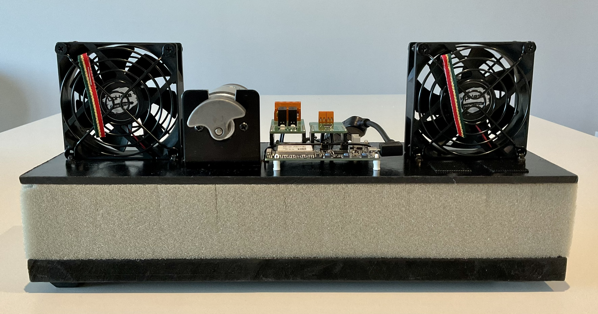

# Predictive maintenance with Machine Learning and Azure Sphere

## Documentation

The full solution documentation is maintained on the [project wiki](https://github.com/gloveboxes/AzureSphereClassify/wiki).

## Watch the 10 minute end-to-end demo

## Machine Learning Predictive Maintenance rig

### Parts list

1. [Avnet Azure Sphere Starter Kit](https://www.avnet.com/wps/portal/us/products/avnet-boards/avnet-board-families/ms-azure-sphere/)
1. [MikroE Relay Click](https://www.mikroe.com/relay-click)
1. [MikroE H-Bridge 7 Click](https://www.mikroe.com/h-bridge-7-click)
1. Vibration motor (Amazon). BestTong DC 12V-24V 8000RPM 775 Brushed Vibration Motor Double-Head High Torque Electric Vibrating Motors with 2 Iron Rotating Mass.
1. Vibration motor mounting bracket (Amazon). Note, required metal work to allow for mounting on the vibration motor.  BestTong 12V/24V DC Motor 775 Series Motor Mount Mounting Bracket 2 Pack
1. Fans (Amazon). upHere PC Fan, 80mm Silent USB Fan Compatible for Computer / PS4 / TV Box/AV Cabinet,U803

